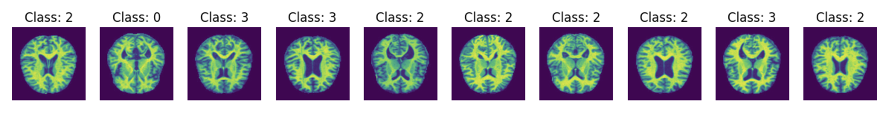
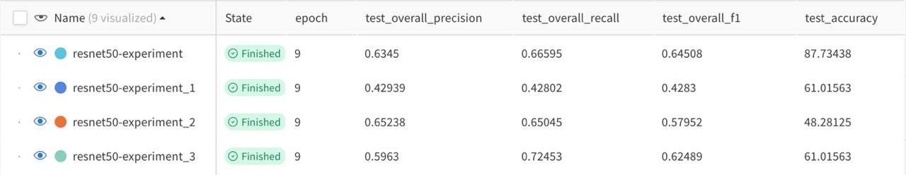

## Отчет о практике 
## Фейгинова Милена Дмитриевна 

- [Ссылка на github репозиторий](https://github.com/MilFey21/GenomeAI)
- [Ссылка на W&B project](https://wandb.ai/milfey21/alzheimer-classification/table)
- [Ссылка на google collab](https://colab.research.google.com/drive/1B_n5-yYOsl3asdWEqz7ZIeHgIXEW6SPS?usp=sharing)

### 0. Определение задачи

В рамках практики магистратуры по искусственному интеллекту мне было дано задание разработать модель для предсказания нейродегенеративных заболеваний на основе генома человека (экспрессии генов). После тщательного изучения открытых данных и научной литературы я пришла к следующим выводам:

1. Разнообразие нейродегенеративных заболеваний

Нейродегенеративные заболевания представляют собой группу разнородных расстройств, которые характеризуются прогрессирующей дегенерацией и/или гибелью нейронов. Каждое заболевание имеет свои уникальные особенности развития и проявления на генетическом уровне[1, 2]. Например, болезнь Альцгеймера, болезнь Паркинсона, боковой амиотрофический склероз и другие нейродегенеративные заболевания затрагивают различные участки мозга и связаны с различными генетическими факторами.

2. Сложность генетических факторов

Анализ экспрессии генов для предсказания нейродегенеративных заболеваний оказался более сложным, чем предполагалось изначально. Существует множество противоречивых данных о том, какие именно экспрессии генов отвечают за развитие конкретных заболеваний [3]. Эта неопределенность связана с несколькими факторами:

- Многофакторная природа заболеваний: большинство нейродегенеративных заболеваний являются результатом сложного взаимодействия между генетическими и экологическими факторами.
- Гетерогенность заболеваний: даже в рамках одного заболевания могут существовать различные подтипы с разными генетическими профилями.
- Ограниченность текущих знаний: несмотря на значительный прогресс в области генетики, многие аспекты генома человека остаются неизученными.

3. Необходимость фокусировки на одном заболевании

Учитывая вышеуказанные сложности, я пришла к выводу, что разработка единой модели для предсказания всех нейродегенеративных заболеваний на основе генома не является реалистичной задачей в рамках данного проекта. Вместо этого, более эффективным подходом будет сосредоточиться на одном конкретном заболевании.

4. Выбор болезни Альцгеймера

После тщательного анализа я решила сфокусироваться на болезни Альцгеймера по следующим причинам:

- Распространенность: Болезнь Альцгеймера является наиболее распространенной формой деменции, затрагивающей миллионы людей во всем мире[4]. По данным Alzheimer's Association, в 2024 году около 6,9 миллионов американцев в возрасте 65 лет и старше живут с болезнью Альцгеймера.
- Доступность данных: Благодаря своей распространенности и интенсивным исследованиям, по болезни Альцгеймера доступно наибольшее количество генетических и клинических данных. Например, проект Alzheimer's Disease Neuroimaging Initiative (ADNI) предоставляет обширную базу данных, включающую генетическую информацию, результаты нейровизуализации и клинические данные[5].
- Социальная значимость: Учитывая растущую распространенность болезни Альцгеймера и ее огромное влияние на пациентов, их семьи и систему здравоохранения, разработка эффективных методов ранней диагностики и прогнозирования этого заболевания имеет огромное социальное значение[6].
- Потенциал для исследований: Несмотря на интенсивные исследования, многие аспекты болезни Альцгеймера остаются неизвестными, что открывает широкие возможности для применения методов искусственного интеллекта и машинного обучения для получения новых знаний[7].

5. Важность мультимодального подхода

Хотя первоначальное задание фокусировалось на анализе генома, мое исследование показало, что для эффективного предсказания болезни Альцгеймера необходим более комплексный, мультимодальный подход[8, 9]. Это обусловлено следующими факторами:

- Ограниченность генетических данных: Несмотря на значительный прогресс в понимании генетических основ болезни Альцгеймера, геном человека не до конца изучен, и многие аспекты генетического влияния на развитие заболевания остаются неясными[10].
- Многофакторная природа заболевания: Болезнь Альцгеймера развивается под влиянием множества факторов, включая генетические, экологические и образ жизни[11].
- Важность клинических данных: Симптомы, когнитивные тесты и история болезни предоставляют критически важную информацию для диагностики и прогнозирования болезни Альцгеймера[12].
- Роль нейровизуализации: МРТ и ПЭТ снимки головного мозга позволяют выявить структурные и функциональные изменения, характерные для болезни Альцгеймера, часто задолго до появления клинических симптомов[13][14].

6. План разработки мультимодальной модели

Учитывая вышеизложенное, я предлагаю следующий план разработки мультимодальной модели для предсказания болезни Альцгеймера:

1) Разработка модели анализа МРТ снимков:
   - Сбор и предобработка данных МРТ из открытых источников (например, ADNI).
   - Разработка и обучение сверточной нейронной сети для анализа структурных изменений мозга, характерных для болезни Альцгеймера.
   - Оценка эффективности модели на независимом наборе данных.

2) Интеграция генетических данных:
   - Анализ экспрессии генов, связанных с болезнью Альцгеймера.
   - Разработка модели для обработки генетических данных.
   - Объединение генетической модели с моделью анализа МРТ.

3) Добавление клинических данных:
   - Интеграция данных когнитивных тестов, симптомов и истории болезни.
   - Разработка модели для обработки клинических данных.
   - Объединение с существующей мультимодальной моделью.

4) Разработка итоговой мультимодальной модели:
   - Создание архитектуры для интеграции всех компонентов (МРТ, генетика, клинические данные).
   - Обучение и оптимизация комплексной модели.
   - Тестирование и валидация на независимом наборе данных.

5) Анализ и интерпретация результатов:
   - Оценка вклада каждой модальности в итоговый прогноз.
   - Выявление наиболее значимых предикторов болезни Альцгеймера.
   - Сравнение эффективности мультимодальной модели с отдельными компонентами и существующими методами диагностики.

Этот подход позволит создать комплексную модель, которая учитывает различные аспекты болезни Альцгеймера и потенциально может обеспечить более точное и раннее предсказание заболевания. Начало с анализа МРТ снимков обеспечит прочную основу для модели, так как нейровизуализация играет ключевую роль в диагностике болезни Альцгеймера[15]. Последующая интеграция генетических и клинических данных позволит улучшить точность и надежность прогнозов.

Такая мультимодальная модель не только может улучшить раннюю диагностику болезни Альцгеймера, но и потенциально предоставит новые insights о взаимосвязи между различными факторами, влияющими на развитие заболевания. Это, в свою очередь, может способствовать разработке новых методов лечения и профилактики болезни Альцгеймера.

### 1. Постановка задачи
#### 1.1 Описание задачи

Разработать модель для выявления ранней стадии болезни Альцгеймера на основе анализа 
МРТ-снимков головного мозга. Целевой аудиторией являются ученые, лаборатории и студенты 
научных направлений, медицинский персонал, работающий с пациентами с нейродегенеративными 
заболеваниями. Это может стать базой для последующей разработки программного обеспечения,
которое принимает и обрабатывает в реальном времени МРТ-снимки, определяет наличие ранней 
стадии заболевания.

#### 1.2 Формирование ML задачи

Задача многоклассовой классификации изображений МРТ головного мозга по следующим 
категориям: норма (отсутствие деменции), очень ранняя стадия болезни Альцгеймера, 
ранняя стадия болезни Альцгеймера, прогрессирующая стадия болезни Альцгеймера

#### 1.3 Желаемый результат в рамках первого семестра

Подготовка данных, определение архитектуры модели многоклассовой классификации, 
проведение экспериментов для получения лучшего качества. Подготовка к последующему созданию ансамбля
моделей, которые будут выдавать предсказания на основе разных данных (снимки МРТ, геном, текстовые клинические показания).

#### 1.4 Желаемый финальный результат
Веб-приложение, позволяющее загружать МРТ-снимки головного мозга, а также другие данные
(геном, показания) и получать вероятностную оценку принадлежности к каждому из классов,
а также визуализацию областей, наиболее значимых для классификации.

#### 1.5 Примеры решения схожих задач
1. Классификация болезни Альцгеймера по МРТ-изображениям мозга. Гибридный подход, сочетающий анализ главных компонент (PCA), пошаговый линейный дискриминантный анализ (SWLDA) и искусственную нейронную сеть (ANN) - [ссылка](https://pmc.ncbi.nlm.nih.gov/articles/PMC10530944/).
2. Система VUNO Med-DeepBrain AD, использующая алгоритм глубокого обучения для диагностики болезни Альцгеймера по Т1-взвешенным МРТ-изображениям. Система продемонстрировала точность 87,1%, чувствительность 93,3% и специфичность 85,5%, что сопоставимо с результатами экспертов-медиков - [ссылка](https://www.nature.com/articles/s41598-022-22917-3). 
3. Классификация болезни Альцгеймера по ПЭТ-изображениям. Подход на основе сочетания 2D сверточных нейронных сетей (CNN) и рекуррентных нейронных сетей (RNN). Метод достиг площади под ROC-кривой 95,3% для классификации болезни Альцгеймера и нормы - [ссылка](https://www.frontiersin.org/journals/neuroinformatics/articles/10.3389/fninf.2018.00035/full).
4. Модель IGnet, интегрирующая методы компьютерного зрения и обработки естественного языка для автоматизированной классификации болезни Альцгеймера с использованием данных МРТ и генетического секвенирования. Модель достигла точности классификации 83,78% и площади под ROC-кривой 0,924 - [ссылка](https://www.frontiersin.org/journals/neuroscience/articles/10.3389/fnins.2022.846638/full).
5. Классификация стадий болезни Альцгеймера с использованием сверточных нейронных сетей - [ссылка](https://journals.vsu.ru/sait/article/view/12140).
6. Применение методов глубокого обучения для обнаружения патологических изменений на МРТ - [ссылка](https://cyberleninka.ru/article/n/effektivnost-algoritmov-mashinnogo-obucheniya-i-svyortochnoy-neyronnoy-seti-dlya-obnaruzheniya-patologicheskih-izmeneniy-na-magnitno).
7. Разработка программного комплекса для автоматического распознавания болезни Альцгеймера по снимку МРТ - [ссылка](https://cyberleninka.ru/article/n/razrabotka-programmnogo-kompleksa-dlya-avtomaticheskogo-raspoznavaniya-bolezni-altsgeymera-po-snimku-mrt).

### 2. Данные

#### 2.1 Структура данных

- МРТ-снимки головного мозга 
- Метаданные пациентов (возраст, пол, клинические оценки)
- Разметка снимков по классам (выполненная экспертами-неврологами)

#### 2.2 Источники данных:
1. Открытые датасеты:
- ADNI 
- OASIS
- GenBank
- RuSeq
2. Репозитории обработанных данных
- ReCount2 - база данных стандартизированных подсчетов экспрессии генов

#### 2.3 Объем данных: 

Минимальный объем для обучения модели: 1000 размеченных МРТ-снимков для каждого класса. 
Оптимальный объем: 5000-10000 снимков на класс.

### 2.4 Выбранный датасет для первого этапа:
Alzheimer MRI Disease Classification dataset ([Hugging face link](https://huggingface.co/datasets/Falah/Alzheimer_MRI)),
который фокусируется на классификации ранних симптомов болезни Альцгеймера.
- Количество изображений train: 5120
- Количество изображений test: 1280

Датасет состоит из сканов МРТ снимков мозга, размеченных на четыре категории:

- 0: Mild_Demented - зарождение болезни
- 1: Moderate_Demented - ранее прогрессирование болезни
- 2: Non_Demented - здоровый мозг (норма)
- 3: Very_Mild_Demented - подозрение на болезнь

Дисбаланс классов довольно высок, однако, если мы научимся прогнозировать второй класс 
(здоровый мозг) с высокой точностью, мы сможем считать модель успешной, несмотря на более 
низкое качество других классов. В медицинской области исследований accuracy играет 
большую роль, если мы говорим о положительных классах (здоровый пациент), а recall более важен, 
когда мы говорим об отрицательных классах (болезнях). Ошибку этап можно устранить 
путем дополнительного осмотра пациента, а пропуск заболевания может обернуться летальным исходом.
Модель должна быть консервативна в отношении классов кроме воторого (здоровый мозг).

### 3. Модель

#### 3.1 Архитектура:

- *Начала с* предварительно обученной модели ResNet50 + модификация последнего слоя. 
- *Перешла на* EfficientNet-B2 (лучшая производительность на медицинских изображениях) с выборочным замораживанием слоев.
- *Окончательная модель* представляет собой усовершенствованную сеть EfficientNet-B2. Архитектура:

#### 3.2 Эксперименты:

0. **Baseline**

**Архитектура:** 
Для бейзлайна использовался ResNet50. Это глубокая сверточная нейронная сеть, которая эффективна для задач классификации изображений.

Исходный финальный слой ResNet заменяется новым последовательным контейнером, состоящим из нескольких слоев:
- Полносвязный слой.
- Функция активации ReLU, применяемая поэлементно.
- Слой dropout с вероятностью отсева 0,5. Это случайным образом обнуляет половину входных элементов во время обучения, что помогает предотвратить переобучение.
- Еще один полносвязный слой, который выводит признаки. Это соответствует итоговым оценкам классификации для каждого класса (в данном случае, различных стадий или типов болезни Альцгеймера).

**Результаты:**

Мы видим, что разница между метриками на обучающей и тестовой выборках незначительна. Это хорошо и означает, что модели не переобучаются.
Давайте посмотрим на матрицу ошибок ниже. Очевидно, что класс Moderate_Demented (1) не идентифицируется моделью.
У него также значительно меньше образцов по сравнению с другими классами, и он в основном путается с классом Nondemented.
Это имеет смысл, так как эти классы выглядят чрезвычайно похожими на первый взгляд. 

Class 0 -- Class 1 -- Class 2 -- Class 3

Мы также можем видеть подтверждение этому на графиках. На тестовых данных классы 0, 2 и 3 показывают схожую динамику, в то время как для класса 1 все метрики равны 0.
Отрицательная тенденция также заметна для класса 1 на обучающих данных. 

**Вывод:** Класс Moderate_Demented не идентифицируется моделью. Изменения могут быть очень тонкими, и модели трудно их уловить.
В дальнейших экспериментах необходимо рассмотреть работу над проблемой дисбаланса классов и попробовать аугментацию данных, чтобы сделать класс Moderate_Demented более заметным для модели.

1. **Data Augmentation**

**Цель:** увеличить accuracy на валидации путем предотвращения переобучения. 

**Идея:** применить аугментацию изображений для повышения разнообразности данных. Использовать такие подходы как
random cropping, horizontal flipping, rotation, and color jittering. Это помогает улучшить обобщающую способность модели путем искусственного увеличения размера обучающего набора данных и внесения вариативности.

**Результаты**: Я не буду подробно останавливаться на метриках для каждого класса, так как все они значительно снизились, в то время как потери выросли с 0,36 до 0,77.

**Вывод:** Хотя аугментация данных показала худшие метрики по сравнению с базовой моделью, я все же решил продолжить тестирование с аугментацией данных, так как считал, что это может быть полезно в дальнейшем, когда проблема дисбаланса классов будет решена.

2. **Balanced Sampling**

**Цель:** уменьшить влияние дисбаланса классов. Обеспечить, чтобы в течение каждой эпохи обучения модель видела сбалансированное представление всех классов, что помогает улучшить показатели производительности.

**Идея:** использовать WeightedRandomSampler. Подсчитать количество вхождений каждой метки класса в наборе данных и назначить веса, равные вероятности выбора этого образца во время обучения.

**Результаты:** Уже на 4-й эпохе модель показала гораздо более высокие метрики по сравнению с базовой моделью.

Что также важно, первый класс наконец-то показал хорошие метрики на валидации:
- test_class_1_f1	0.92857
- test_class_1_precision	1
- test_class_1_recall	0.86667

Тем не менее, loss вырос до 1.09.

**Вывод:** balanced sampling эффективно регулирует дизбаланс классов, поэтому будет далее использован в модели в рамках последующих экспериментов.

3. **EfficientNet-B2**

**Цель:** исследовать другие доступные предобученные модели и попытаться достичь лучшего качества.

**Идея:** EfficientNet-B2 известна тем, что лучше работает с медицинскими данными [28]. Например, она достигла точности 
и полноты выше 95% при обнаружении таких состояний, как COVID-19 и опухоли мозга, что указывает на ее надежность в выявлении тонких паттернов в медицинских изображениях, критически важных для точной диагностики. Я решил заморозить 30 ранних слоев для трансферного обучения.

**Результаты:**

Хотя точность снизилась (в основном за счет худшей точности для несбалансированных классов), все остальные метрики значительно выросли.
Также потери уменьшились до 0,87.

Это может быть связано с дисбалансом классов: модель правильно предсказывает мажоритарный класс, но испытывает трудности с миноритарными классами,
она все еще может достичь высокой точности и полноты, имея при этом низкую точность из-за множества ложноположительных результатов в своих предсказаниях.
Кроме того, если модель начинает переобучаться на обучающих данных, она может научиться хорошо предсказывать определенные классы, но не сможет эффективно обобщать на все классы.

**Вывод:** EfficientNet-B2 действительно показала лучшие результаты на медицинских данных, чем ResNet50. Без каких-либо дополнительных настроек было достигнуто увеличение точности на 21%.
Однако проблемы переобучения на преобладающих классах и дисбаланса классов все еще присутствуют и должны быть решены.

4. **Усовершенствованный классификатор**

**Цель:** дальнейшее повышение точности и полноты, таким образом, улучшение способности к обобщению. Особенно это важно для менее представленных классов, предотвращая переобучение.

**Идея:** использовать глубокий многослойный классификатор с остаточными соединениями и добавить пакетную нормализацию после каждого слоя. Применение прогрессивного отсева 
(выше в ранних слоях) помогает предотвратить переобучение, особенно при работе с меньшими наборами данных. Инициализация Xavier для лучшей сходимости.

**Результаты:**

Все отслеживаемые метрики растут, а потери уменьшаются. Та же тенденция наблюдается для каждого класса.
Важно отметить, что вместе с усовершенствованным классификатором я увеличил количество эпох.
Однако мы можем видеть на графике ниже, что даже на ранних эпохах эта модель показала более высокое качество.

**Вывод:** Усовершенствованный классификатор помог улучшить метрики для малых классов и уменьшить разрыв между точностью на обучающем и тестовом наборах данных.

5. **No data augmentation**

**Цель:** увеличить precision

**Идея:** проведя много тестов, я поняла, что в некоторых клоссов слишком мало данных для использования дополнительной аугментации. 
Особенно в малорепрезентативных классах, аугментация может мешать сети выявлять паттерны. 
Возвращаясь к первому эксперименты, мы видим, что аугментация снизила качество классификации. При этом мы знаем, что МРТ изображения стандартизированны 
и редко могут быть поданы в сеть в перевернутом или искаженном виде. Поэтому протестируем ту же архитектуру без аугментации.

**Результаты:** 

Как и ожидалось, качество существенно выросло.

**Вывод:** По-видимому, набор данных действительно слишком мал для обширной аугментации данных. Я также полагаю, что это может быть особенностью медицинских данных. 
Поскольку все изображения представляют собой снимки мозга в одинаковом положении, вращение и изменение изображений не помогает, так как реальная ценность скрыта в незначительных изменениях сканов мозга.

6. **Веса классов в функции потерь**

**Цель:** дальнейшее управление значительной проблемой дисбаланса классов. При стандартном обучении без весов классов CNN может стать предвзятой к мажоритарным классам.

**Идея:** включить веса в функцию потерь. Использовать базовый подход и назначить каждому классу вес, равный вероятности встречи этого класса в обучающем наборе данных.

**Результаты:**

Потери выросли, в то время как все остальные метрики качества снизились. По сравнению с базовой моделью, решение все еще лучше, однако по сравнению с последним тестом наблюдается снижение.

**Вывод:** Назначая более высокие штрафы за ошибки в миноритарных классах, веса классов помогают улучшить способность модели к обобщению. 
Однако существует риск того, что модель может слишком сосредоточиться на обучении на миноритарных классах в ущерб мажоритарным классам. 
Этот дисбаланс может привести к потере важной информации, необходимой для точных прогнозов по всем классам. Определение подходящих весов классов часто требует тщательной настройки и экспериментов.

7. **Stochastic Gradient Descent (SGD) optimizer**

**Цель:** увеличить скорость обучения и эффективно минимизировать функцию потерь

**Идея:** использовать стохастический градиентный спуск (SGD) в качестве оптимизатора, так как он известен своей 
вычислительной и памятной эффективностью.

**Результаты:**

Давайте сравним с предыдущим тестом, так как до сих пор он показывал лучшие результаты.

Все общие и покласссовые метрики значительно улучшились.

**Вывод:** Стохастическая природа SGD вносит случайность в процесс оптимизации, что помогает алгоритму избегать локальных минимумов и более эффективно исследовать пространство параметров[29, 30]. 
SGD обновляет параметры для каждого обучающего примера по одному, что делает его эффективным по памяти и позволяет обрабатывать большие наборы данных, которые не могут поместиться в память. 
Кроме того, SGD может быть более быстрым, чем другие варианты градиентного спуска, такие как пакетный градиентный спуск, поскольку он использует только один пример для обновления параметров.

8. **Улучшенная модель EfficientNet-B2**

**Цель:** попробовать собственную архитектуру модели, добавив лучшие практики к существующей предобученной модели. Сделать большой скачок в качестве благодаря исследованиям и их применению.

**Идея:** Проведя исследование по использованию предобученных моделей, особенно для медицинских данных, я внес несколько значительных улучшений в модель:

- Увеличил количество обучаемых слоев.
- Добавил многослойный классификатор с тремя плотными блоками. Каждый имеет пакетную нормализацию для лучшей стабильности обучения, активацию ReLU для нелинейности, dropout для регуляризации.
- Добавил канальное внимание для адаптивного взвешивания каналов признаков.
- Реализовал dropout с настраиваемым коэффициентом (по умолчанию 0.4).

Теперь модель имеет следующий поток признаков:

Input image -> EfficientNet features -> Feature maps -> Global Average Pooling -> Flattened features -> Channel Attention -> Attended features -> Classifier -> Output (see visualisation of architecture above)

**Результаты:** 

Давайте сравним с предыдущим тестом, так как до сих пор он показывал лучшие результаты. Мы можем видеть дальнейшее улучшение качества.
Это подчеркивает важность осмысленного использования предобученных моделей.

**Вывод:**
Чем больше модификаций, основанных на особенностях данных, выполняется, тем лучший результат и качество могут быть достигнуты.
Например, небольшие и слабо варьирующиеся наборы данных, такие как тот, который я использовал, подвержены большому риску 
переобучения и требуют внимания к устойчивости и способности к обобщению для меньших классов.

#### 3.3 Appendix. Сравнение экспериментов: графики и таблицы

**Overall quality metrics**

**Precision and Recall by class**

**F1 by class**

**Loss**

### 4. Перспективы

#### 4.1 Дополнительные гипотезы и модели
1. Исследование возможности раннего выявления других нейродегенеративных заболеваний (Паркинсона, Леви) на основе той же архитектуры [31, 32].
2. Разработка моделей для прогнозирования скорости прогрессирования заболевания [32].
3. Применение методов интерпретируемого ИИ для объяснения решений модели специалистам [33].
4. Исследование возможности использования мультимодальных данных (МРТ + когнитивные тесты + генетические маркеры) для повышения точности диагностики [35].

#### 4.2 Влияние текущих разработок в сфере ИИ
1. Использование больших языковых моделей (например, GPT-4) для анализа текстовых медицинских записей и интеграции их с результатами анализа МРТ [34, 36].
2. Внедрение методов федеративного обучения и дифференциальной приватности для обеспечения конфиденциальности данных пациентов при обучении моделей [37].
3. Использование техник автоматического машинного обучения (AutoML) для оптимизации архитектуры и гиперпараметров моделей [39, 40, 41].
4. Применение методов объяснимого ИИ (XAI) для повышения доверия врачей к результатам работы системы [38].
5. Использование технологий квантовых вычислений для ускорения обработки больших объемов данных и оптимизации сложных моделей машинного обучения.

Эти инновации могут значительно улучшить точность, эффективность и масштабируемость предложенного решения.

### 5. Цитируемые ссылки

[1] https://www.nature.com/articles/s41598-024-56001-9

[2] https://www.frontiersin.org/journals/aging-neuroscience/articles/10.3389/fnagi.2022.876202/full

[3] https://www.nature.com/articles/s41598-022-20674-x

[4] https://pmc.ncbi.nlm.nih.gov/articles/PMC11167621/

[5] https://www.nature.com/articles/s41467-022-31037-5

[6] https://onlinelibrary.wiley.com/doi/abs/10.1002/sim.9683

[7] https://www.nature.com/articles/s41598-024-60134-2

[8] https://www.rsna.org/news/2024/may/deep-learning-predicts-alzheimer-markers

[9] https://www.nature.com/articles/s41598-024-53733-6

[10] https://pmc.ncbi.nlm.nih.gov/articles/PMC8623867/

[11] https://onlinelibrary.wiley.com/doi/full/10.1002/advs.202204717

[12] https://pmc.ncbi.nlm.nih.gov/articles/PMC6170939/

[13] https://www.frontiersin.org/journals/public-health/articles/10.3389/fpubh.2022.853294/full

[14] https://www.nature.com/articles/s41598-022-22917-3

[15] https://pmc.ncbi.nlm.nih.gov/articles/PMC8869427/

[16] https://www.mdpi.com/2075-4418/14/16/1759

[17] https://www.mdpi.com/2504-4990/6/1/24

[18] https://www.mdpi.com/2075-4418/13/7/1216

[19] https://cyberleninka.ru/article/n/razrabotka-programmnogo-algoritma-polucheniya-izobrazheniy-mrt-golovnogo-mozga

[20] https://symmetria-med.ru/blog/7-metrik-dlya-otsenki-effektivnosti-sayta-kliniki.html

[21] https://pmc.ncbi.nlm.nih.gov/articles/PMC10530944/

[22]https://www.nature.com/articles/s41598-022-22917-3

[23] https://www.frontiersin.org/journals/neuroinformatics/articles/10.3389/fninf.2018.00035/full

[24] https://www.frontiersin.org/journals/neuroscience/articles/10.3389/fnins.2022.846638/full

[25] https://journals.vsu.ru/sait/article/view/12140

[26] https://cyberleninka.ru/article/n/effektivnost-algoritmov-mashinnogo-obucheniya-i-svyortochnoy-neyronnoy-seti-dlya-obnaruzheniya-patologicheskih-izmeneniy-na-magnitno

[27] https://cyberleninka.ru/article/n/razrabotka-programmnogo-kompleksa-dlya-avtomaticheskogo-raspoznavaniya-bolezni-altsgeymera-po-snimku-mrt

[28] https://arxiv.org/html/2410.22392v4

[29] https://en.wikipedia.org/wiki/Stochastic_gradient_descent

[30] https://www.researchgate.net/figure/Comparison-of-SGD-and-GD-a-GD-b-SGD_fig1_367555827

[31] https://www.clinicbarcelona.org/en/news/the-clinic-idibaps-confirms-definitively-that-rem-sleep-disorder-is-the-precursor-of-neurodegenerative-diseases-such-as-parkinsons-disease

[32] https://pmc.ncbi.nlm.nih.gov/articles/PMC9758217/

[33] https://www.nature.com/articles/s41746-023-00837-4

[34] https://www.lih.lu/en/article/using-machine-learning-to-predict-alzheimers-and-parkinsons/

[35] https://pmc.ncbi.nlm.nih.gov/articles/PMC10363100/

[36] https://www.lih.lu/en/article/using-machine-learning-to-predict-alzheimers-and-parkinsons/

[37] https://www.mdpi.com/2075-4426/14/3/277

[38] https://arxiv.org/html/2403.04130v1

[39] https://onlinelibrary.wiley.com/doi/full/10.1002/med4.75

[40] https://www.nature.com/articles/s41598-024-60429-4

[41] https://kdd.org/exploration_files/7._CR._27._Techniques_for_Automated_Machine_Learning-2.pdf

